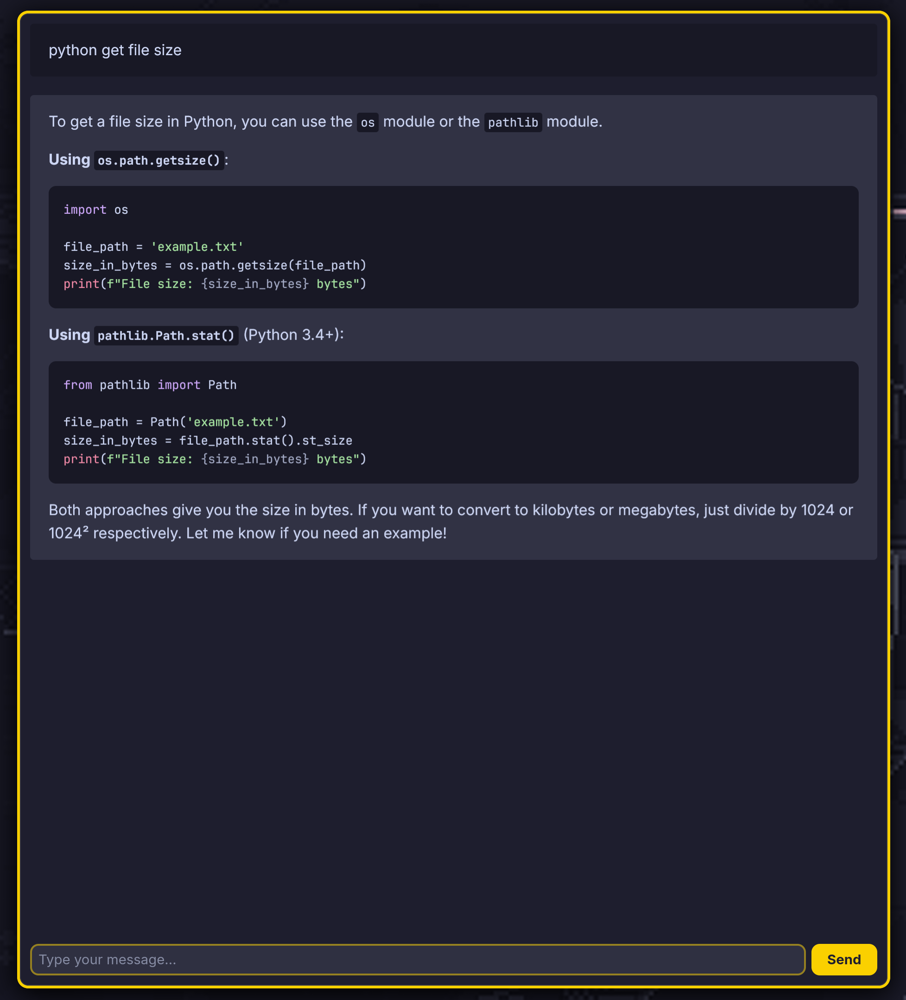
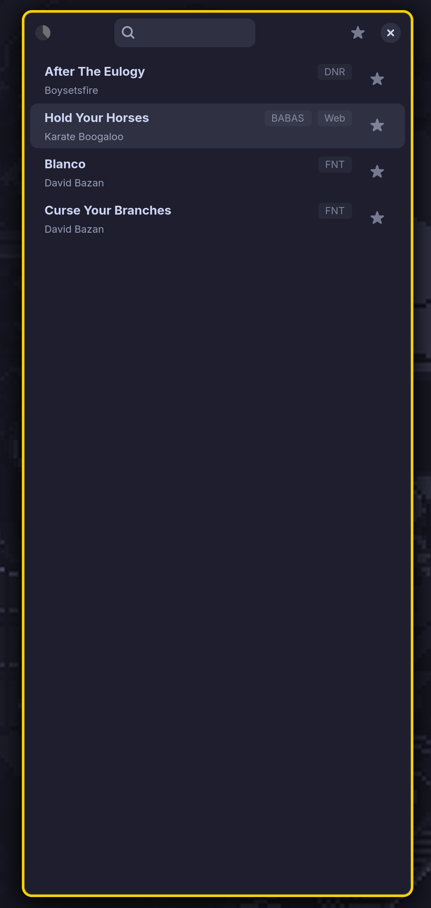
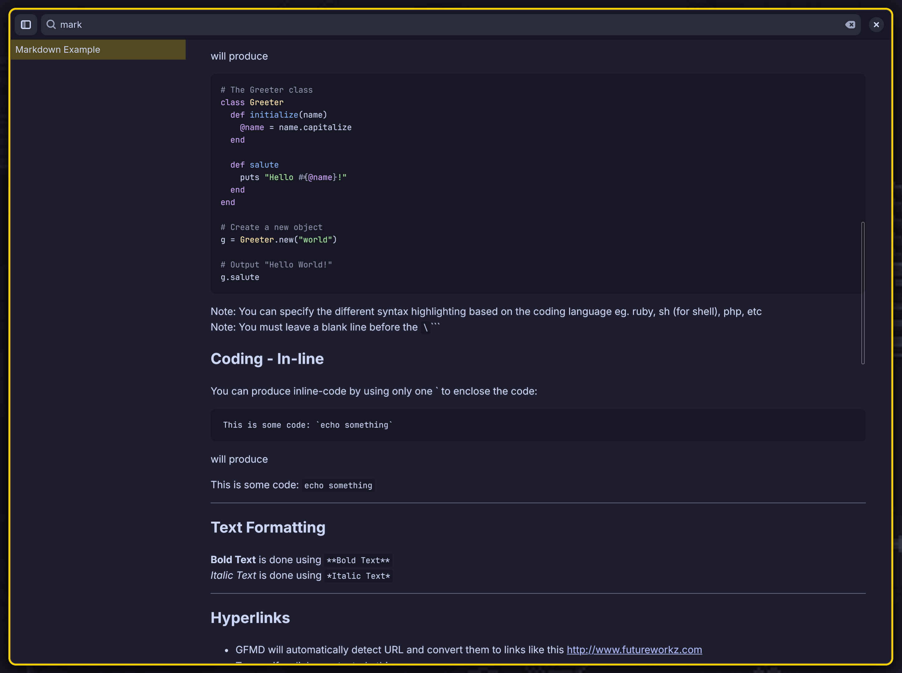
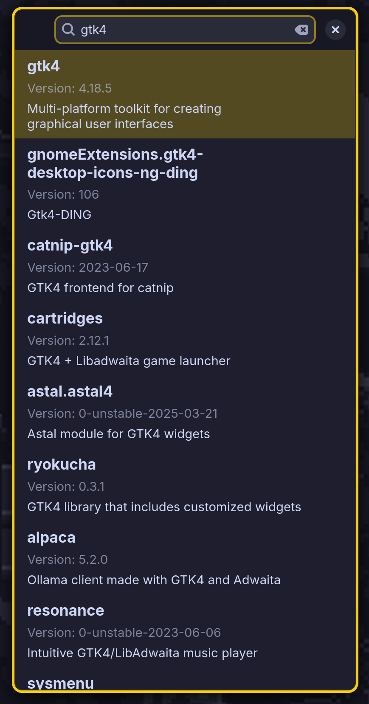
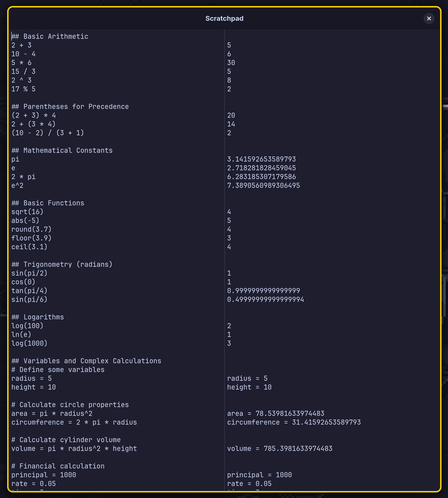
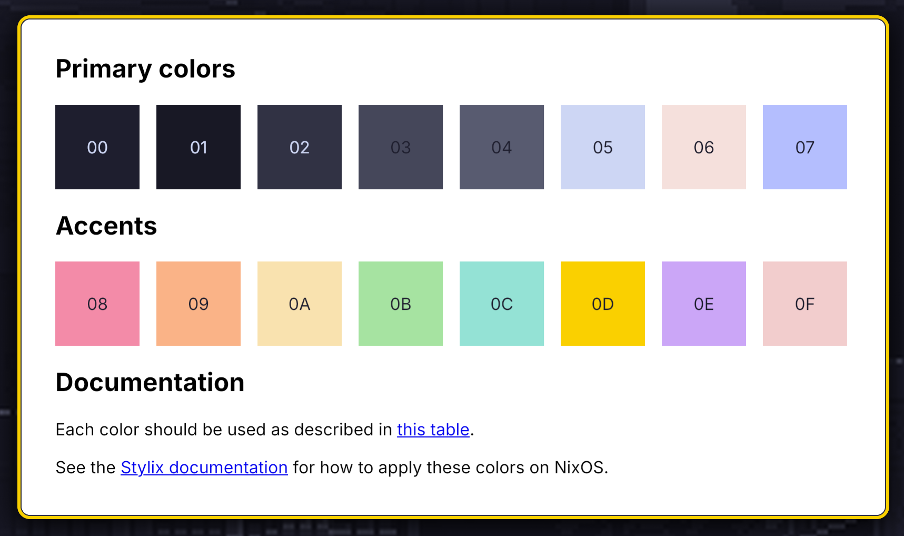

# Vibe Apps

A collection of vibe-coded, keyboard-centric, minimalist GTK4/Adwaita applications built with Python and Nix.

## Applications

### Bookmarks

A fast Firefox bookmarks browser with search functionality and keyboard navigation.


### Chat

A chat interface for OpenAI's API with markdown rendering support and streaming responses.



### Dataset Viewer (ds)

A simple command-line tool for viewing image/caption datasets pairs.


### Launcher

A minimalist application launcher with search functionality and launch history tracking.


### Music

A minimalist music player with library management and queue functionality.



### Notes

A markdown note-taking application with wiki-links support and live preview.



### Nix Packages

A simple interface to query and browser nix packages.



### Scratchpad Calculator

An interactive scratchpad calculator, similar to Soulver. (Work in Progress)



### WebKit Shell

A minimal web browser shell for wrapping web applications in GTK windows.



### Utilities

- **md2html**: A markdown to HTML converter with support for GFM, wiki-links, and syntax highlighting. Used by Chat and Notes.
- **raise-or-open-url**: A utility to raise existing windows or open new ones based on URLs (niri, brotab)

# Installation and Usage

## Option 1: Direct Nix Run

Run individual applications directly with nix:

```bash
# Run specific apps
nix run https://github.com/knoopx/vibeapps/archive/refs/heads/main.zip#bookmarks
nix run https://github.com/knoopx/vibeapps/archive/refs/heads/main.zip#notes
nix run https://github.com/knoopx/vibeapps/archive/refs/heads/main.zip#launcher
nix run https://github.com/knoopx/vibeapps/archive/refs/heads/main.zip#chat
```

## Option 2: Home Manager Module

This flake provides a home-manager module for easier management and installation.

### 1. Add the flake to your home-manager configuration

In your `flake.nix`:

```nix
{
  inputs = {
    nixpkgs.url = "github:NixOS/nixpkgs/nixpkgs-unstable";
    home-manager = {
      url = "github:nix-community/home-manager";
      inputs.nixpkgs.follows = "nixpkgs";
    };
    vibeapps = {
      url = "github:knoopx/vibeapps";  # Or path:/path/to/vibeapps for local
      inputs.nixpkgs.follows = "nixpkgs";
    };
  };

  outputs = { nixpkgs, home-manager, vibeapps, ... }: {
    homeConfigurations.yourusername = home-manager.lib.homeManagerConfiguration {
      pkgs = nixpkgs.legacyPackages.x86_64-linux;
      modules = [
        vibeapps.homeManagerModules.default
        ./home.nix
      ];
    };
  };
}
```

### 2. Enable programs in your home.nix

```nix
{
  programs.vibeapps = {
    # Enable individual programs
    notes.enable = true;
    chat.enable = true;
    launcher.enable = true;
    music.enable = true;
    scratchpad.enable = true;

    # Or enable all programs at once
    # enableAll = true;
  };
}
```

### Available Programs

The following programs can be enabled individually:

- `bookmarks` - Bookmark management application
- `chat` - OpenAI API chat interface with markdown rendering
- `dataset-viewer` - Image/caption dataset viewer for ML workflows
- `launcher` - Fast application launcher with search
- `mdx-editor` - Advanced markdown editor with live React components
- `music` - Music library browser with album management
- `notes` - Markdown note-taking with wiki-links and live preview
- `nix-packages` - Nix package repository browser and search
- `reminder` - Calendar event creation interface
- `scratchpad` - Interactive mathematical calculator
- `webkit-shell` - Minimal web browser for wrapping web applications

- `md2html` - Advanced markdown to HTML converter
- `raise-or-open-url` - Smart URL/window management

### Example Configuration

Complete example configuration:

```nix
{
  programs.vibeapps = {
    # Core productivity apps
    notes.enable = true;
    scratchpad.enable = true;
    launcher.enable = true;

    # Media and browsing
    music.enable = true;
    webkit-shell.enable = true;

    # Development tools
    chat.enable = true;
    nix-packages.enable = true;

    # Utilities
    bookmarks.enable = true;
    reminder.enable = true;
  };
}
```

After rebuilding your home-manager configuration, all enabled programs will be available in your PATH.


# Future Work

* OTP app that uses pickerwindow and displays a lists of sites and their OTP codes using pyotp.
* Passwords app (libsecret)
* Niri Windows app
* Diffusers app
* Events app
  * uses evolution-data-server
  * Search also parses time and appies filters
  * Uses dateparser to parse natural language
  * Shows calendar when creating new event
* Bookmarks v2:
    * uses its own sqlite database to store bookmarks instead of firefox
    * built-in bookmarking (just paste link in search entry)
      * scrapes websites and summarizes it using openai
      * screenshots it (using firefox)
      * shows notification after scraping
