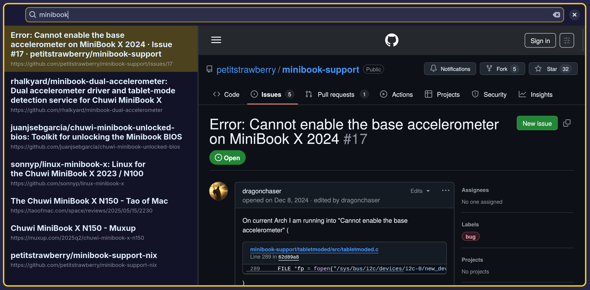
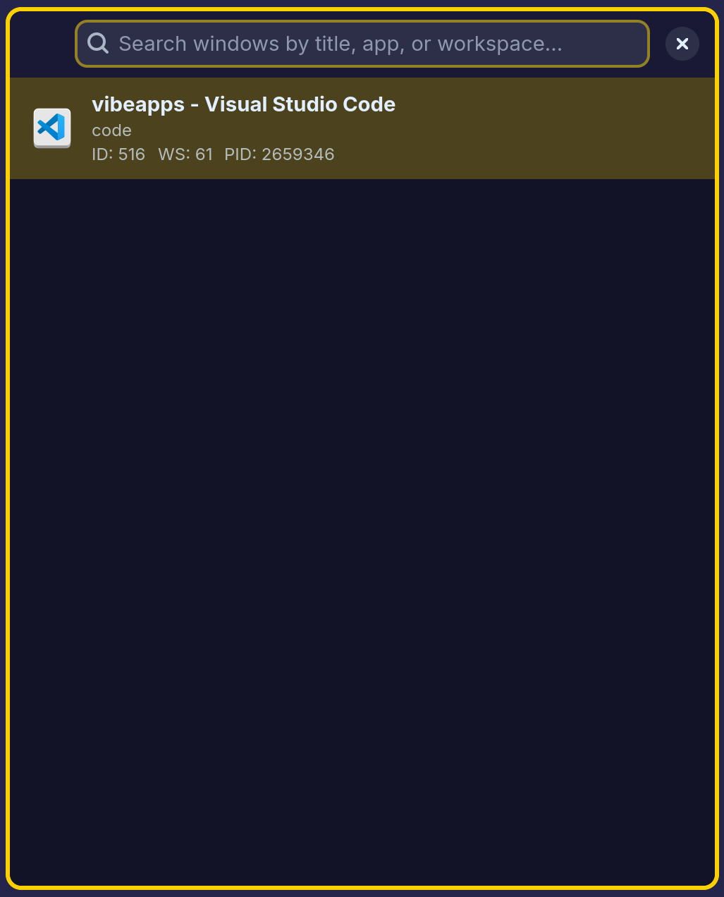

# Vibe Apps

A collection of fast, keyboard-centric, minimalist GTK4/Adwaita applications built with Python and Nix. Inspired by productivity tools like Raycast, Alfred, and Quicksilver, with a focus on speed and instant app startup.

## Applications

### [Bookmarks](apps/bookmarks/README.md)

A fast and intuitive bookmark browser with real-time search, automatic Firefox profile detection, context menu actions, and keyboard navigation.



### [Chat](apps/chat/README.md)

An AI-powered chat application using OpenAI's GPT models, with real-time streaming responses, markdown rendering, and conversation history management.


### [Dataset Viewer](apps/dataset-viewer/README.md)

A specialized GTK4 dataset viewer for images and captions, with live caption editing and efficient keyboard navigation.


### [Launcher](apps/launcher/README.md)

An intelligent GTK4 application launcher with fuzzy search, smart ranking, and adaptive suggestions based on usage patterns.


### [File Picker](apps/file-picker/README.md)

A fast GTK4 file picker for scripts and automation. Reads grouped file lists from stdin, displays them with checkboxes for multi-selection, and prints selected files to stdout. Designed for keyboard navigation and integration into shell workflows.


### [Music](apps/music/README.md)

A music library manager with intelligent scanning, automatic metadata extraction, custom collections, star ratings, and advanced filtering.


### [Notes](apps/notes/README.md)

A markdown note-taking app with live preview, fast fuzzy search, file management, and wiki-links support.


### [Nix Package Search](apps/nix-packages/README.md)

A modern GTK4 interface for real-time Nix package search with detailed package information and clipboard integration.


### [Scratchpad](apps/scratchpad/README.md)

An interactive scratchpad calculator with real-time expression evaluation, variable support, error highlighting, and advanced mathematical functions.


### [WebKit Shell](apps/webkit-shell/README.md)

A lightweight WebKit-based shell for creating dedicated web app windows, with session persistence, custom window settings, and CLI options.


### [Windows](apps/windows/README.md)

A Niri compositor window management UI with live window listing, advanced search, and window control operations.



### [Wireless Networks](apps/wireless-networks/README.md)

A comprehensive GTK4 WiFi manager with real-time network scanning, connection management, security status display, and detailed network information.


### Utilities

- [md2html](utils/md2html/): A markdown-to-HTML converter with support for GFM, wiki-links, and syntax highlighting.

# Installation and Usage

## Option 1: Direct Nix Run

Run individual applications directly with nix:

```bash
# Run specific apps
nix run https://github.com/knoopx/vibeapps/archive/refs/heads/main.zip#bookmarks
nix run https://github.com/knoopx/vibeapps/archive/refs/heads/main.zip#notes
nix run https://github.com/knoopx/vibeapps/archive/refs/heads/main.zip#launcher
nix run https://github.com/knoopx/vibeapps/archive/refs/heads/main.zip#chat
nix run https://github.com/knoopx/vibeapps/archive/refs/heads/main.zip#wireless-networks
```

## Option 2: Home Manager Module

This flake provides a home-manager module for easier management and installation.

### 1. Add the flake to your home-manager configuration

In your `flake.nix`:

```nix
{
  inputs = {
    nixpkgs.url = "github:NixOS/nixpkgs/nixpkgs-unstable";
    home-manager = {
      url = "github:nix-community/home-manager";
      inputs.nixpkgs.follows = "nixpkgs";
    };
    vibeapps = {
      url = "github:knoopx/vibeapps";  # Or path:/path/to/vibeapps for local
      inputs.nixpkgs.follows = "nixpkgs";
    };
  };

  outputs = { nixpkgs, home-manager, vibeapps, ... }: {
    homeConfigurations.yourusername = home-manager.lib.homeManagerConfiguration {
      pkgs = nixpkgs.legacyPackages.x86_64-linux;
      modules = [
        vibeapps.homeManagerModules.default
        ./home.nix
      ];
    };
  };
}
```

### 2. Enable programs in your home.nix

```nix
{
  programs.vibeapps = {
    # Enable individual programs
    notes.enable = true;
    chat.enable = true;
    launcher.enable = true;
    music.enable = true;
    scratchpad.enable = true;
    wireless-networks.enable = true;

    # Or enable all programs at once
    # enableAll = true;
  };
}
```

### Available Programs

The following programs can be enabled individually:

- `bookmarks` - Bookmark management application
- `chat` - OpenAI API chat interface with markdown rendering
- `dataset-viewer` - Image/caption dataset viewer for ML workflows
- `launcher` - Fast application launcher with search
- `music` - Music library browser with album management
- `notes` - Markdown note-taking with wiki-links and live preview
- `nix-packages` - Nix package repository browser and search
- `scratchpad` - Interactive mathematical calculator
- `webkit-shell` - Minimal web browser for wrapping web applications
- `windows` - Window manager for niri with focus/close actions
- `wireless-networks` - WiFi network manager with connection and security management
- `md2html` - Advanced markdown to HTML converter

### Example Configuration

Complete example configuration:

```nix
{
  programs.vibeapps = {
    notes.enable = true;
    scratchpad.enable = true;
    launcher.enable = true;
    bookmarks.enable = true;
    music.enable = true;
    chat.enable = true;
    nix-packages.enable = true;
    windows.enable = true;
    wireless-networks.enable = true;
  };
}
```

After rebuilding your home-manager configuration, all enabled programs will be available in your PATH.

# Future Work

- OTP app that uses pickerwindow and displays a lists of sites and their OTP codes using pyotp.
- Passwords app (libsecret)
- Diffusers app
- Browser History
- Regular Expression REPL
- Events app
  - uses evolution-data-server
  - Search also parses time and appies filters
  - Uses dateparser to parse natural language
  - Shows calendar when creating new event

# Credits

- Icons from https://www.thiings.co/things
